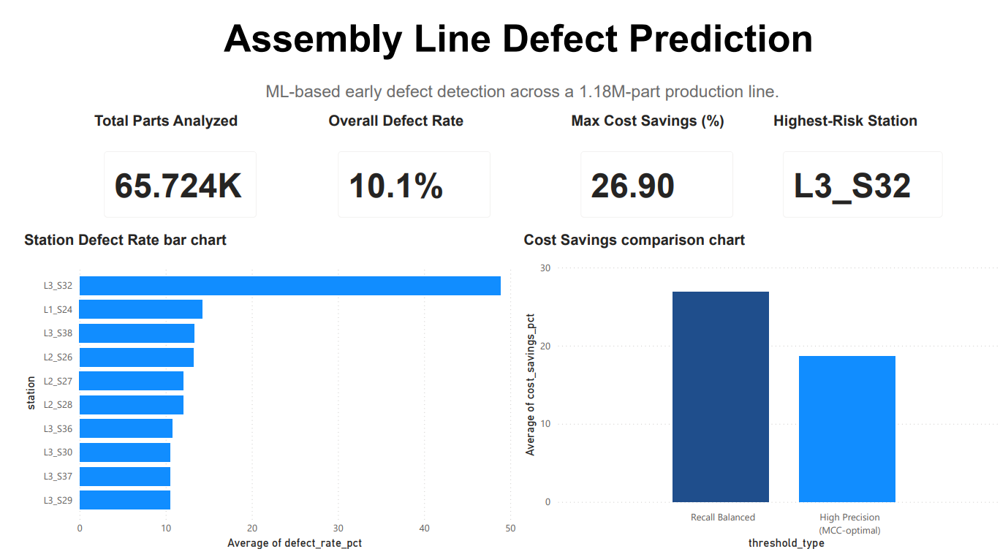
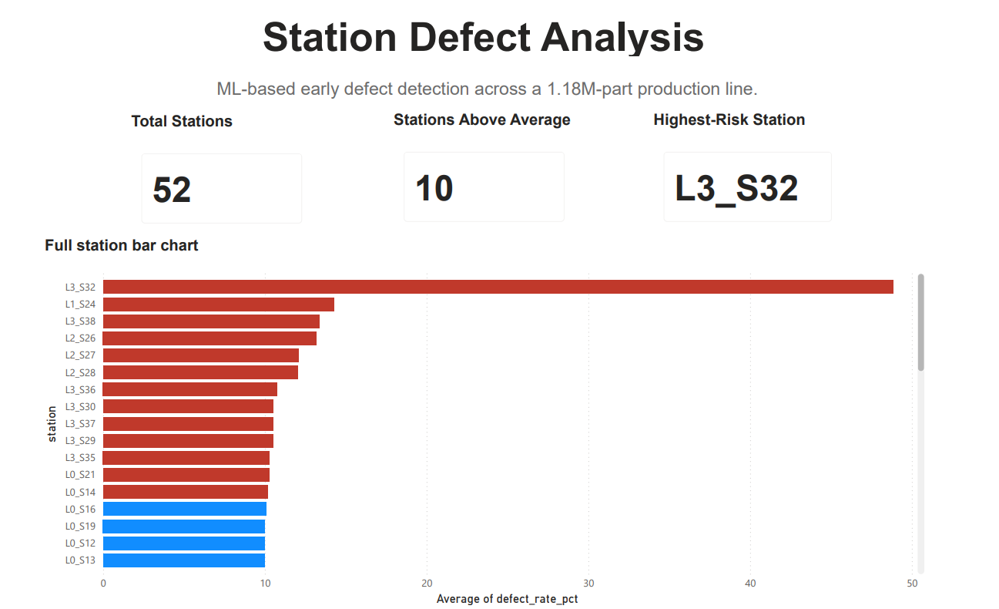
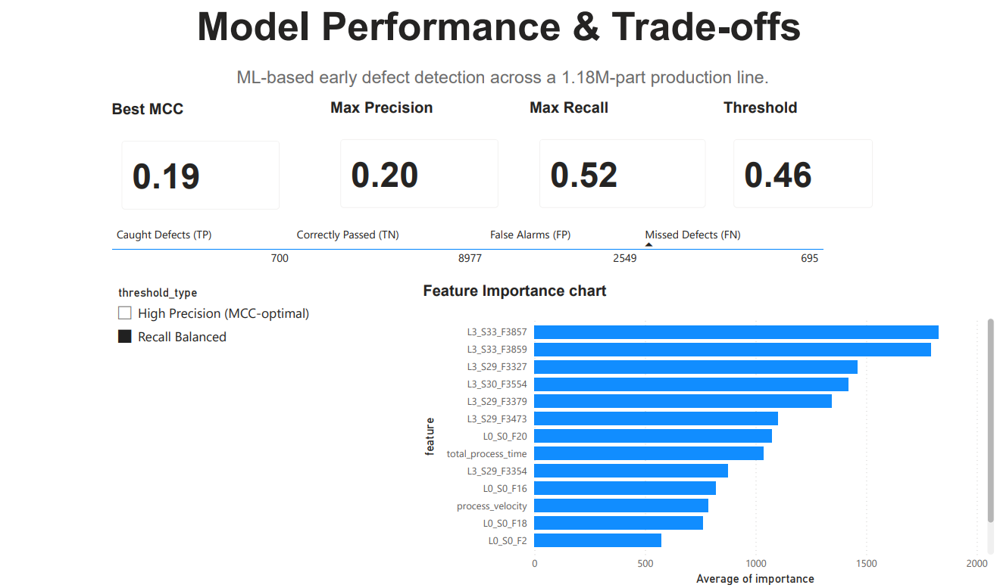

🏭 Assembly Line Defect Prediction | End-to-End ML & Analytics Project
======

> Predicting manufacturing defects on a 1.18M-part automotive assembly line — from raw Bosch sensor data to a tuned classifier to a business cost decision, built entirely on free tools.

`PySpark` • `LightGBM` • `Databricks` • `Power BI` • `scikit-learn` • `pandas`


---

## 📌 Table of Contents

- [Executive Summary](#-executive-summary)
- [Business Problem](#-business-problem)
- [Dataset Overview](#-dataset-overview)
- [Pipeline](#️-pipeline)
  - [Phase 1–2: Data Loading & Spark ETL](#phase-12-data-loading--spark-etl)
  - [Phase 3: Feature Engineering](#phase-3-feature-engineering)
  - [Phase 4: Feature Selection](#phase-4-feature-selection)
  - [Phase 5: Modeling](#phase-5-modeling)
  - [Phase 6: Business Translation](#phase-6-business-translation)
  - [Phase 7: Power BI Dashboard](#phase-7-power-bi-dashboard)
- [A Real Data-Quality Bug](#-a-real-data-quality-bug-and-the-fix)
- [Key Business Insights](#-key-business-insights)
- [Repository Structure](#-repository-structure)
- [Tech Stack](#️-tech-stack)
- [Installation](#-installation)
- [Skills Demonstrated](#-skills-demonstrated)
- [About the Author](#-about-the-author)
- [Future Improvements](#-future-improvements)

---

## 📌 Executive Summary

This project builds an end-to-end defect-prediction system on Bosch's real production-line sensor dataset — 1.18M parts, 4,384 raw sensor features across 52 stations. The pipeline covers Spark-based ETL, statistical feature selection, a tuned LightGBM classifier, and a business-facing cost analysis, closing with a 3-page Power BI dashboard built for non-technical stakeholders.

The core question isn't "can we predict defects" — it's **"is catching them worth the cost of inspecting more parts, and by how much?"**


---

## 🎯 Business Problem

Undetected defects that ship to customers cost far more than defects caught on the line — rework, warranty claims, and reputational damage all scale up the later a defect is caught. Manufacturing teams need to know: **which stations are producing the most risk, and can a model flag likely-defective parts early enough to be worth the extra inspection?**

This project answers that with real precision/recall trade-offs and a cost-avoided estimate, not just a model accuracy score.

---

## 📁 Dataset Overview

**Source:** [Bosch Production Line Performance](https://www.kaggle.com/c/bosch-production-line-performance) (Kaggle)

| | |
|---|---|
| Total parts (stratified sample) | 65,724 |
| Raw sensor features | 4,384 |
| Stations across the line | 52 (4 production lines: L0–L3) |
| Original defect rate | ~0.58% (highly imbalanced) |
| Sample defect rate (preserved) | ~10.5% |

Three raw file types: **numeric** (971 cols), **categorical** (2,141 cols), **date** (1,272 cols) — joined on part `Id`.

---

## ⚙️ Pipeline

### Phase 1–2: Data Loading & Spark ETL
Stratified sampling preserving the true defect ratio, loaded into Spark DataFrames, validated row/column counts, profiled null rates (structural — parts only visit a subset of 52 stations), joined on `Id`.

### Phase 3: Feature Engineering
- 52 binary station-visit flags + `total_stations_visited`
- Per-station timing → `total_process_time`, `process_velocity`
- Line-level missingness ratios (`missing_pct_L0`–`L3`)

### Phase 4: Feature Selection
`4,384 → 121 features`, ranked via two independent methods:
- **Decision Tree importance** (numeric columns)
- **Chi-Square test with hash-encoding** (categorical columns — bypasses StringIndexer's model-size limits)

Both methods independently converged on the same hot zone: **`L3_S32`, `L1_S24`**.

### Phase 5: Modeling
- LightGBM with `scale_pos_weight` for class imbalance
- Hyperparameter tuning via `RandomizedSearchCV` (20 iterations × 3-fold CV, scored on PR-AUC)
- Threshold selected on a **held-out validation set only** — final metrics computed once on an untouched test set (no leakage)

| Operating Point | Threshold | Precision | Recall | MCC |
|---|---|---|---|---|
| High Precision | 0.740 | 81% | 21% | **0.386** |
| Recall Balanced | 0.464 | 20% | 52% | 0.192 |

### Phase 6: Business Translation
Converted the confusion matrix into cost-avoided terms using the **1-10-100 Rule of Quality Costs** (external failure cost ≈ 10× appraisal cost) — explicitly labeled as an assumption, since Bosch's public dataset has no real cost data.

| Threshold | Cost Savings vs. No Inspection |
|---|---|
| High Precision | 18.7% |
| Recall Balanced | **26.9%** |

A sensitivity sweep (3×–15× cost ratio) shows the *optimal threshold flips* depending on how expensive a missed defect actually is — a genuinely useful decision framework, not a single cherry-picked number.

### Phase 7: Power BI Dashboard
3-page executive dashboard:
1. **Overview** — KPIs, top-10 riskiest stations, cost-savings comparison
2. **Station Analysis** — full 52-station breakdown, color-coded by risk
3. **Model Performance** — threshold-togglable KPIs, confusion matrix, feature importance

| Overview | Station Analysis | Model Performance |
|---|---|---|
|  |  |  |

---

## 🐛 A Real Data-Quality Bug (and the fix)

Midway through modeling, ~1,047 of 2,141 categorical columns were found to have been silently mistyped as `timestamp` by Spark's `inferSchema=True` — string values like `"T1"`/`"T3"` were being misread and collapsed into a single garbage date. Root-caused by reloading with `inferSchema=False`, verified the corruption was label-only (Chi-Square rankings were unaffected, since row groupings never changed), and rebuilt the clean feature table before proceeding. Documented here because catching this kind of silent schema-inference failure is a real, transferable data-engineering skill — not just a footnote.

---

## 💡 Key Business Insights

- **`L3_S32` is a massive risk concentration**: only ~3% of parts visit this station, but 48.85% of the parts that do are defective — nearly 4× the rate of any other station.
- **The technically "best" model isn't automatically the business-best choice.** The high-MCC threshold catches only 21% of defects; the recall-balanced threshold catches 52% and saves more money under standard cost assumptions — despite a lower MCC.
- **Engineered features earned their place**: `total_process_time` and `process_velocity` (not raw sensor readings) rank in the model's top 10 most important features, validating the manual feature engineering work.

---

## 📊 Repository Structure

```
├── notebooks/
│   └── 01_etl_defect_prediction.ipynb   # Full pipeline: ETL → features → model → cost analysis
├── src/
│   └── sample_*.py                       # Local stratified sampling scripts
├── requirements.txt
└── README.md
```

*(Raw data, virtual environment, and dashboard export CSVs are excluded via `.gitignore`.)*

---

## 🛠️ Tech Stack

| Category | Tools |
|---|---|
| Distributed Processing | PySpark (Databricks Free Edition) |
| Modeling | LightGBM, scikit-learn |
| Data Manipulation | pandas |
| Visualization | Power BI |
| Version Control | Git / GitHub |

---

## 🚀 Installation

```bash
git clone https://github.com/Aadish-code-create/Assembly_Line_Defect_Prediction.git
cd Assembly_Line_Defect_Prediction
python -m venv venv
venv\Scripts\activate        # Windows
pip install -r requirements.txt
```

Notebook is designed to run on Databricks (Free Edition compatible — serverless, no manual clusters required).

---

## 🎓 Skills Demonstrated

`Spark ETL` `Feature Engineering` `Statistical Feature Selection (Chi-Square, Decision Trees)` `Imbalanced Classification` `Hyperparameter Tuning` `Threshold Optimization` `Data Leakage Prevention` `Cost-Benefit Business Translation` `Power BI Dashboarding` `Root-Cause Debugging` `Git/GitHub Workflow`

---

## 👤 About the Author

**Aadish** — B.Tech, Computer & Communication Engineering, Manipal University Jaipur (2026). Currently IT Intern at Honda Cars India Limited. Building a portfolio in data science & analysis, with a focus on translating technical model output into decisions non-technical stakeholders can act on.

---

## 🔭 Future Improvements

- Scale sampling to the full 1.18M-row dataset (currently a stratified subsample)
- Explore SHAP values for per-prediction explainability
- Automate the Power BI refresh via a scheduled Databricks export job